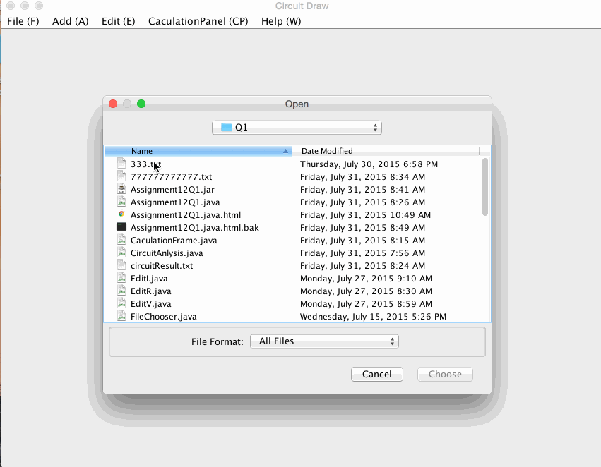

# Java-Application
Circuit NodAL Analysis Application (Object Oriented Programing MVC Model)

## Java Circuite Nodal Analysis Application

Developed an circuit analysis application, which supported to draw circuits to edit elements (wires,
resistors, voltage, and current sources), to read and write text file operations; This software can support
user to generated circuit diagram and properties of elements by moving mouse to move, add, delete, and simulate
real circuits. This application is based on MVC design model and implement 80% functions of <b>LTspice IV</b>(circuit
design software) , this application is for free.)

## Technology

Use the java basic libarary
- java.util
- java.io.FileReader
- java.io.BufferedReader;
- java.io.IOEXcepetion
- java.awt
- javaax.swing.

## Custom class
CaculationFrame.java, CircuitAnlysis.java, EditI.java, EditR.java, FileChooser.java, FileWirte.java, Icurrent.java, IcurrentDraw.java, Line1.java, LineDraw.java, PaintAll.java, Resistor.java, TextArea.java, UserInstruction.java, Voltage.java, VoltageDraw.java, WireDraw.java

  

## License

Copyright 2015 LEE 

Licensed to the Apache Software Foundation (ASF) under one or more contributor license agreements. See the NOTICE file distributed with this work for additional information regarding copyright ownership. The ASF licenses this file to you under the Apache License, Version 2.0 (the “License”); you may not use this file except in compliance with the License. You may obtain a copy of the License at

http://www.apache.org/licenses/LICENSE-2.0

Unless required by applicable law or agreed to in writing, software distributed under the License is distributed on an “AS IS” BASIS, WITHOUT WARRANTIES OR CONDITIONS OF ANY KIND, either express or implied. See the License for the specific language governing permissions and limitations under the License.
